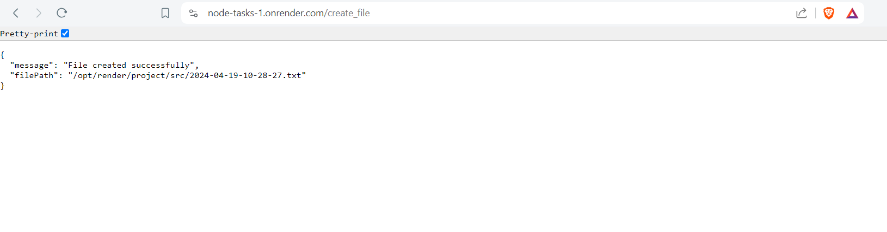

# Nodejs- Day -1: Nodejs
## Web developer task
### **NodeJS file System**
**OBJECTIVE:**   
- Install express library package.    
          **npm i express**.

- Install Luxon is a modern JavaScript library for working with dates and times,  
          **npm i luxon**.

  -------------------------------------------------------------------   
***1)Write an API endpoint will create a text file in a particular folder***

- Content of the file is current timestamp .
- The file name should be current date-time.txt

**API endpoint created:** https://node-tasks-1.onrender.com/create_file

- Api contains a message and filepath at which file is created.     

- In this format "yyyy-MM-dd-HH-mm-ss" txt-file are created.

**output referenece:**

- 

---------------------------------------------------------
***2)Write an API endpoint to retrive all the text files in a particular folder***

**API endpoint created:** https://node-tasks-1.onrender.com/list_txt_files

- Api contains all the names of the txt-files in the folder.

- In this format "yyyy-MM-dd-HH-mm-ss" txt-files names are displayed in the output.

**output referenece:**

- 

 
-----------------------------------------

**NOTE:** The file timestamp is generated using the Oregon time zone due to the requirements of this API created on render.com.
