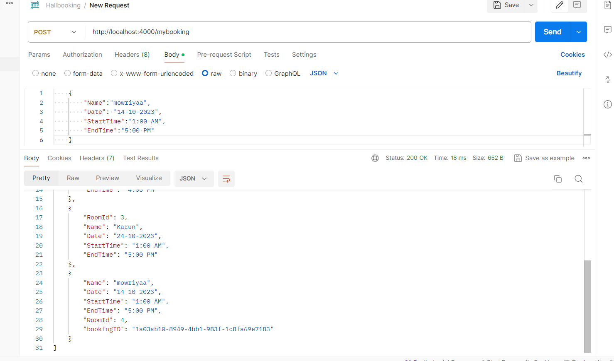
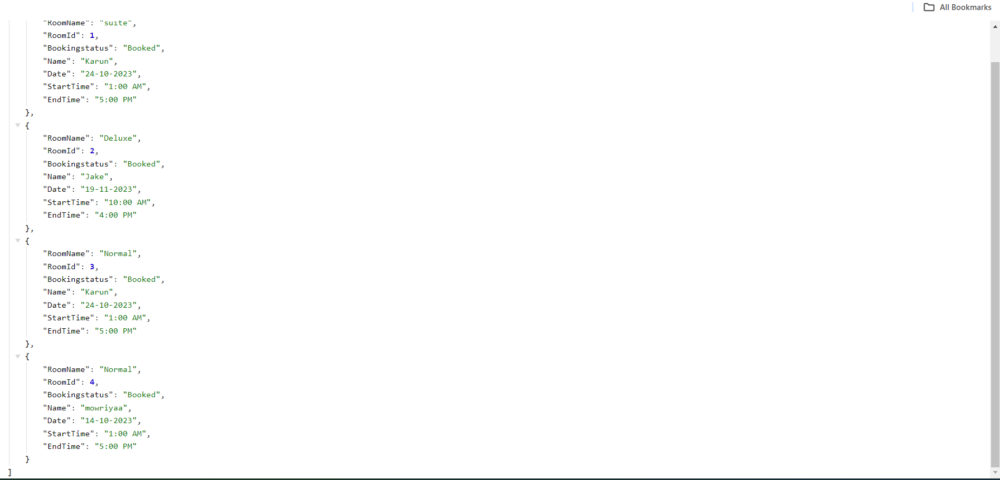
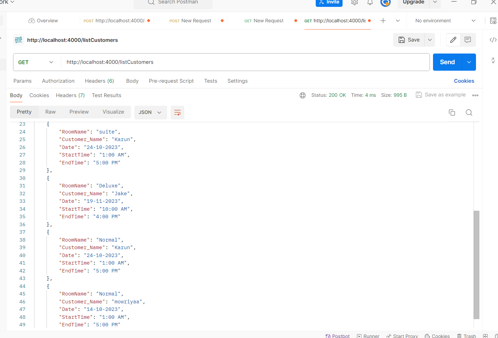
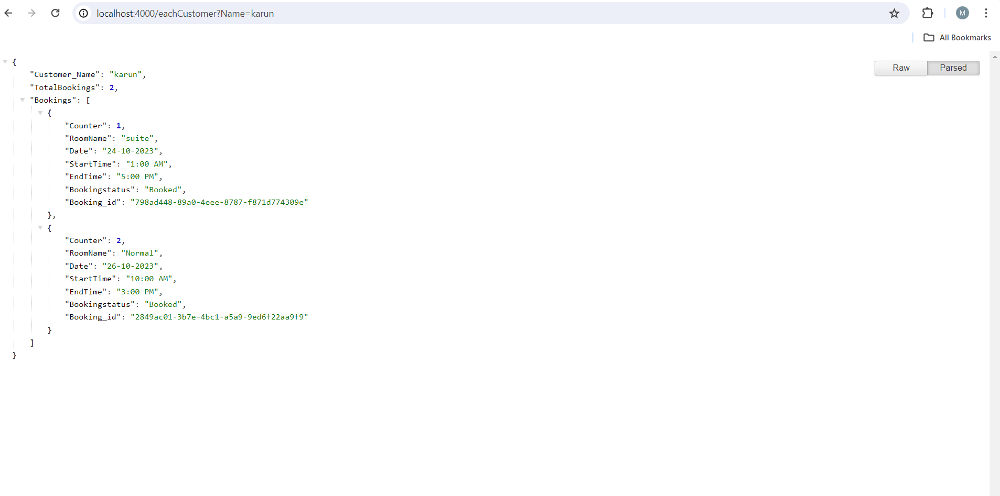

# Nodejs- Day -2: Nodejs & Express.js

## Hall Booking API

the task is to api for the Hall booking app for

### Creating a room with details given in document

- **Post Method** is used to create a room with details given.  

- 

### Booking a room with details given in document:*

- Here also **Post Method** is used to create a Book a specific room with details given.

### List all rooms with Booked Data with details given in document:

- **GET method** is used to get all rooms details that are booked .

### List all Customers with Booked Data with details given in document:

- **GET method** is used to get rooms details that  each customer booked.

    

### List How many times a customer has booked the room with details given in document:

- **GET method** is used to get information about the how many times a specific customer has made a booking.

